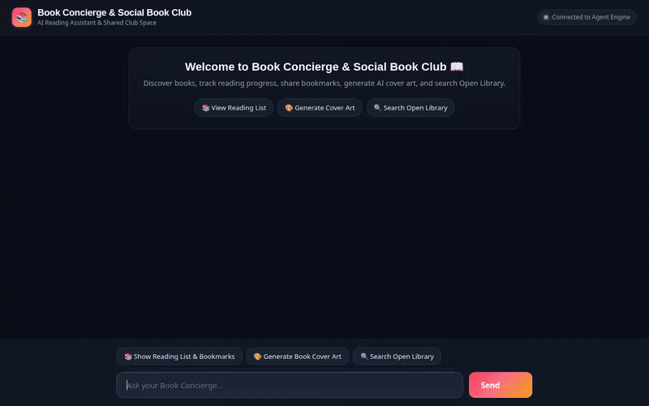

# 📚 Book Concierge & Social Book Club

An enterprise-grade, conversational AI agent built with Google's **Agent Development Kit (ADK)** and deployed on **Google Cloud Agent Runtime**. **Book Concierge & Social Book Club** acts as an intelligent reading assistant that helps readers manage reading lists, track bookmarks, discover real-world books from public catalogs, generate custom AI cover art, and persist reader preferences across sessions.



---

## 🌟 Architecture & Features

The application combines a multi-tool ADK agent backend with a dark glassmorphic FastAPI proxy frontend, supporting rich **A2UI (Agent-to-User Interface)** protocol rendering.

### 🛠️ Implemented Features & Google Cloud Integrations

| Feature / Service | Implementation Details | Code Location |
| :--- | :--- | :--- |
| **Vertex AI Memory Bank** | Persists long-term reader preferences and facts across sessions using `PreloadMemoryTool` and post-turn callbacks. | [`app/agent.py`](file:///config/Desktop/Session1/book-concierge-agent/app/agent.py) |
| **Google Cloud Firestore** | Manages a real-time reading list database (`books` collection) to track books, ratings, page bookmarks, and reading progress. | [`app/agent.py`](file:///config/Desktop/Session1/book-concierge-agent/app/agent.py), [`seed_firestore.py`](file:///config/Desktop/Session1/book-concierge-agent/seed_firestore.py) |
| **Vertex AI Image Gen (`gemini-3.1-flash-lite-image`)** | Generates custom book cover art from text prompts in global region. | [`app/agent.py`](file:///config/Desktop/Session1/book-concierge-agent/app/agent.py) |
| **Google Omni Video Gen (`gemini-omni-flash-preview`)** | Generates short cinematic book trailer videos via Interactions API in global region, saves session artifacts, and uploads MP4 bytes to public Cloud Storage. | [`app/agent.py`](file:///config/Desktop/Session1/book-concierge-agent/app/agent.py) |
| **Google Cloud Storage** | Uploads generated cover art and video trailer bytes to a public GCS bucket (`book-concierge-media-*`) and returns HTTPS URLs for rich card rendering. | [`app/agent.py`](file:///config/Desktop/Session1/book-concierge-agent/app/agent.py) |
| **Open Library REST API** | Searches the public Open Library catalog for real-world book metadata, authors, first publish years, and edition counts. | [`app/agent.py`](file:///config/Desktop/Session1/book-concierge-agent/app/agent.py) |
| **A2UI Protocol Cards (v0.8)** | Generates structured rich UI surfaces (`Card`, `Column`, `Row`, `Text`, `Image`) via `A2uiSchemaManager` and `a2ui_callback`. | [`app/agent.py`](file:///config/Desktop/Session1/book-concierge-agent/app/agent.py), [`app/a2ui_utils.py`](file:///config/Desktop/Session1/book-concierge-agent/app/a2ui_utils.py) |
| **Custom Web UI & FastAPI Proxy** | Enterprise glassmorphic frontend proxy communicating with the backend over the **A2A (Agent-to-Agent)** protocol. | [`frontend/main.py`](file:///config/Desktop/Session1/book-concierge-agent/frontend/main.py), [`frontend/static/index.html`](file:///config/Desktop/Session1/book-concierge-agent/frontend/static/index.html) |

---

## 🔮 Planned / Stretch Menu (Not Yet Implemented)

The following capabilities were outlined in early design briefs but are not yet implemented in the codebase:

- **Vertex AI RAG Engine**: Vector store grounding over uploaded PDF ebook documents.
- **PDF Ebook Reader & Group Reading Rooms**: In-browser document viewer for shared book club reading sessions.
- **Python Code Sandbox**: Automated statistical charts and reading speed analytics.

---

## 📂 Project Structure

```
book-concierge-agent/
├── app/
│   ├── agent.py               # Main ADK agent logic & tool definitions
│   ├── a2ui_utils.py          # A2UI response formatting callback
│   ├── fast_api_app.py        # FastAPI backend server
│   └── app_utils/             # ADK app utility functions
├── frontend/
│   ├── main.py                # FastAPI proxy server (A2A protocol bridge)
│   ├── static/
│   │   └── index.html         # Glassmorphic web chat interface & A2UI renderer
│   ├── Dockerfile             # Container configuration for Cloud Run deployment
│   └── requirements.txt       # Frontend proxy dependencies
├── seed_firestore.py          # Script to seed Firestore database with sample books
├── agents-cli-manifest.yaml   # Agent Runtime deployment manifest
├── GEMINI.md                  # Development guide & instructions
└── pyproject.toml             # Python project dependencies
```

---

## 🚀 Local Setup & Running Instructions

### Prerequisites

Ensure you have installed:
- **Python 3.11+**
- **uv**: Python package manager (`pip install uv`)
- **google-agents-cli**: Installed via `uv tool install google-agents-cli`
- **Google Cloud SDK (`gcloud`)**: Authenticated to your GCP project with Firestore and Cloud Storage enabled.

### 1. Install Dependencies

```bash
# Install backend dependencies
agents-cli install

# Install frontend proxy dependencies
pip install -r frontend/requirements.txt
```

### 2. Seed Firestore Database (Optional)

Seed the Firestore `books` collection with sample reading list records:

```bash
python seed_firestore.py
```

### 3. Run the Agent Backend

Start the local Agent Development Kit (ADK) development server / playground:

```bash
agents-cli playground
```

Or run the agent backend via ADK:

```bash
uv run adk web app
```

### 4. Run the Web Frontend Proxy

In a separate terminal, launch the FastAPI web frontend proxy:

```bash
cd frontend
python -m uvicorn main:app --host 0.0.0.0 --port 8085
```

Open your web browser and navigate to the local frontend port (e.g. port `8085`) to interact with the agent.

---

## ☁️ Cloud Deployment

To deploy the agent to Google Cloud Agent Runtime:

```bash
agents-cli deploy
```

To deploy the web frontend proxy to Google Cloud Run:

```bash
gcloud run deploy book-concierge-ui \
  --source frontend \
  --region us-east1 \
  --platform managed \
  --allow-unauthenticated \
  --set-env-vars AGENT_ENGINE_RESOURCE_NAME="<YOUR_AGENT_ENGINE_RESOURCE_NAME>",AGENT_DIRECTORY="app"
```

---

## 📄 License

Licensed under the Apache License, Version 2.0.
